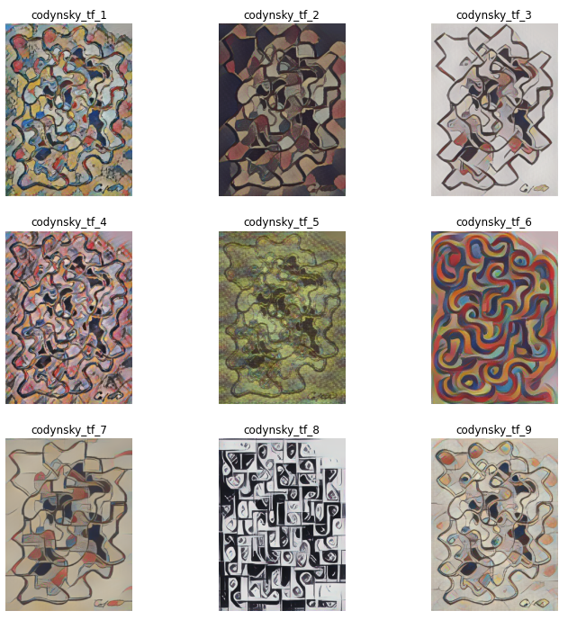

## Codinsky - A Style Transfer Project

This notebook does the following:

1. Imports libraries
2. Identifies a directory full of original works that wish to be styled. 
3. Identifies a directory full of style works that wish to be applied to original works
4. Generates stylized versions of the content images 

### Example Output:

